# Production-Style Kubernetes Ingress Architecture
## Exposing Multiple Microservices Through AWS Application Load Balancer


**DevOps Engineering Presentation & Architecture Deep Dive**  
**Author / Presenter:** Senior DevOps Engineer  
**Scope:** Kubernetes Ingress, AWS ALB Controller, ClusterIP Services, Workload Pods, and Asynchronous Microservice Pipelines  
**Source of Truth:** Repository Kubernetes YAML Manifests (`1-voting-app.yaml` through `miniproject-ingress.yaml`)  
**Target Domains:** `vote.somesh.xyz` & `result.somesh.xyz`

---

## 📑 Repository Manifests & File Index

| File | Type | Description |
| :--- | :--- | :--- |
| **[`miniproject-ingress.yaml`](./miniproject-ingress.yaml)** | `Ingress` | Layer-7 Ingress definition with AWS ALB annotations (`internet-facing`, `target-type: ip`) |
| **[`1-voting-app.yaml`](./1-voting-app.yaml)** | `Deployment` | Voting App frontend (Python/Flask, 2 replicas, port 80) |
| **[`2-volting-app-service.yaml`](./2-volting-app-service.yaml)** | `Service` | ClusterIP Service for Voting App (Port 80) |
| **[`3-redics-app.yaml`](./3-redics-app.yaml)** | `Deployment` | In-Memory Redis queue (1 replica, port 6379) |
| **[`4-redics-service.yaml`](./4-redics-service.yaml)** | `Service` | ClusterIP Service for Redis (`redis:6379`) |
| **[`5-worker-deploy.yaml`](./5-worker-deploy.yaml)** | `Deployment` | Background queue consumer (.NET Core Daemon) |
| **[`6-postgres-deploy.yaml`](./6-postgres-deploy.yaml)** | `Deployment` | PostgreSQL database (Port 5432) |
| **[`7-postgres-service.yaml`](./7-postgres-service.yaml)** | `Service` | ClusterIP Service for PostgreSQL (`db:5432`) |
| **[`8-result-app-deployment.yaml`](./8-result-app-deployment.yaml)** | `Deployment` | Result App dashboard (Node.js/Angular, port 80) |
| **[`9-result-service.yaml`](./9-result-service.yaml)** | `Service` | ClusterIP Service for Result App (Port 80) |
| **[`presentation.html`](./presentation.html)** | `Slide Deck` | Interactive dark-mode presentation with speaker notes drawer (`open presentation.html`) |
| **[`KUBERNETES_INGRESS_PRESENTATION.md`](./KUBERNETES_INGRESS_PRESENTATION.md)** | `Document` | Standalone presentation document copy |

---

## 🏛️ Architecture Blueprint

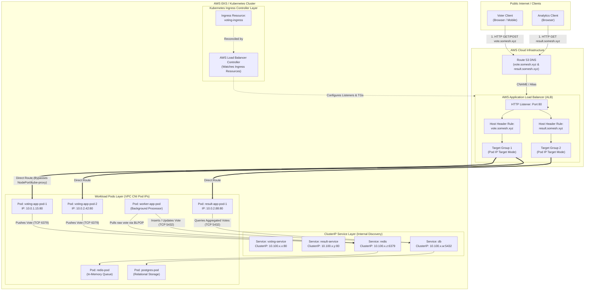

---

## 🖥️ Interactive Presentation
You can run the bundled interactive HTML slide deck locally in your browser:
```bash
open presentation.html
```
* **Navigate:** Press Left (`←`) and Right (`→`) arrow keys.
* **Speaker Notes:** Press `S` to toggle presenter notes.
* **Interview Q&A:** Click the **📋 20 Interview Q&As** button in the header.

---

# 14-Slide Technical Presentation Deck

---

## Slide 1 — Title
### Kubernetes Ingress Architecture: Exposing Multiple Microservices Through AWS Application Load Balancer
**DevOps Project Presentation** | **Kubernetes** | **AWS EKS** | **Ingress** | **Microservices**

#### Technical Highlights
* **Centralized Edge Ingestion:** Unifying external traffic for distributed microservices through a single managed AWS Application Load Balancer (ALB).
* **Host-Based Layer 7 Switching:** Dynamic routing for `vote.somesh.xyz` and `result.somesh.xyz` at the cloud boundary.
* **Direct Pod IP Ingress:** Native AWS VPC CNI routing via `target-type: ip`, bypassing NodePort and kube-proxy DNAT latency.
* **Zero-Trust Internal Network:** Application workloads, cache, and state stores isolated entirely on private Kubernetes `ClusterIP` networks.

> 🎙️ **Speaker Notes:**  
> *"Good morning, everyone. Today I'm presenting a production-style Kubernetes Ingress architecture based on a real-world microservice deployment on AWS. When designing containerized systems, one of the most critical platform decisions is how external user traffic enters the cluster safely and reaches target pods. In this project, I engineered a centralized ingress pattern using the AWS Load Balancer Controller and Kubernetes Ingress, exposing multiple microservices—our voting frontend and real-time results portal—through a single managed Application Load Balancer using host-based routing. Over the next 15 minutes, I'll walk you through the end-to-end traffic flow, why this architecture avoids anti-patterns like multiple public load balancers, the AWS-specific annotations configured in the manifests, and how requests journey from DNS down to pod network namespaces and state stores."*

---

## Slide 2 — Project Overview
### Example Voting Application — Multi-Tier Microservice Topology

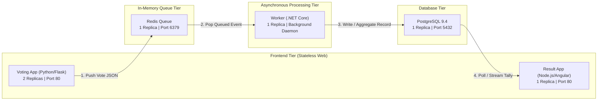

#### Component Breakdown & Functional Roles
1. **Voting App (`dockersamples/examplevotingapp_vote`):** High-throughput user-facing web frontend (Python/Flask). Accepts user votes (`Cats` vs `Dogs`) and immediately enqueues them onto Redis to guarantee sub-millisecond response times. Runs **2 replicas** for high availability.
2. **Redis (`redis:latest`):** In-memory message buffer buffering write surges, decoupling frontend ingestion from backend database writes.
3. **Worker (`dockersamples/examplevotingapp_worker`):** Background daemon written in .NET Core. Continuously monitors the Redis queue, deselects votes, and writes them to PostgreSQL.
4. **PostgreSQL (`postgres:9.4`):** Relational persistence store housing the `votes` schema and running totals.
5. **Result App (`dockersamples/examplevotingapp_result`):** Node.js & Socket.io dashboard querying PostgreSQL to render real-time poll results to viewers.

> 🎙️ **Speaker Notes:**  
> *"To understand our networking requirements, let's look at the application topology. This is a classic distributed microservice architecture featuring an asynchronous processing pipeline. Notice the separation of concerns: our Python voting frontend does not touch the database directly; it offloads votes to Redis in memory. A background .NET worker consumes events from Redis and writes them to PostgreSQL. Finally, the Node.js result app queries Postgres to display real-time analytics. From an infrastructure perspective, notice that out of five components, only TWO require public ingress: the Voting App and the Result App. The Worker, Redis, and PostgreSQL must remain strictly private. This is where Kubernetes Ingress shines."*

---

## Slide 3 — Why Do We Need Ingress?
### The Problem: Exposing Multiple Applications in Kubernetes

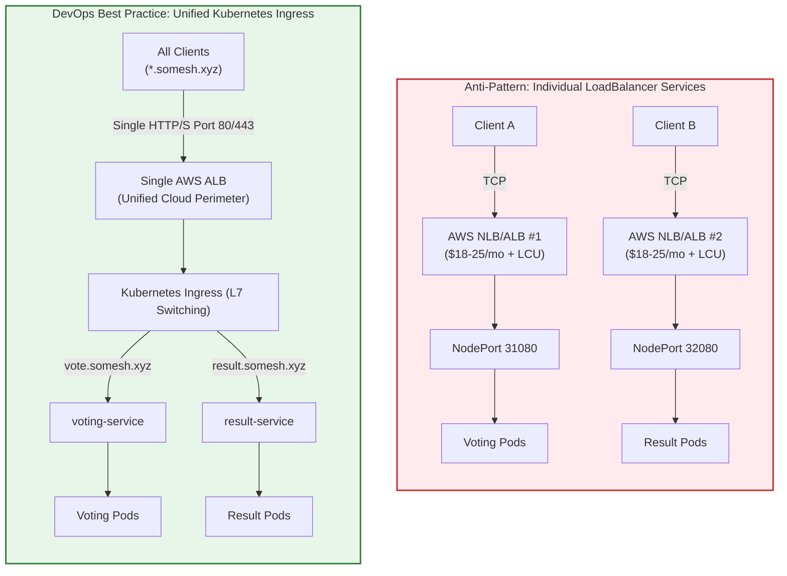

#### Comparison Matrix: Service Type LoadBalancer vs. Kubernetes Ingress

| Architecture Dimension | Multiple `LoadBalancer` Services | Kubernetes Ingress + AWS ALB |
| :--- | :--- | :--- |
| **AWS Resource Footprint** | Provisions a dedicated AWS ELB/NLB per Service | **Single AWS ALB** serves entire cluster ingress |
| **Cloud Cost Model** | Base hourly cost multiplied by $N$ services + data fees | Consolidated base cost; pay only for combined LCUs |
| **TLS / SSL Management** | Certificates attached across multiple load balancers | Centralized ACM wildcard certificate binding on one listener |
| **DNS Architecture** | Disjointed CNAME records to distinct AWS DNS names | Clean subdomain mapping (`*.somesh.xyz`) to a single ALB |
| **Routing Intelligence** | Layer 4 (IP/Port) only; no HTTP header visibility | **Layer 7 aware:** Host headers, URI paths, HTTP methods |
| **Attack Surface** | Multiple public IPs/endpoints exposed to the internet | Single, hardened security perimeter / WAF inspection point |

> 🎙️ **Speaker Notes:**  
> *"When junior engineers deploy multiple web services on Kubernetes, their immediate instinct is often to change every Service type to LoadBalancer. From a DevOps and cloud economics perspective, that is an anti-pattern. If you have 10 microservices, creating 10 LoadBalancer services provisions 10 distinct AWS ELBs or NLBs. That means 10 times the base AWS hourly cost, fragmented DNS records, multiple public endpoints to secure, and zero Layer-7 routing intelligence. Instead, our architecture uses Kubernetes Ingress. A single AWS Application Load Balancer acts as our cluster front door. We route traffic based on HTTP Host headers—sending vote.somesh.xyz to our voting pods and result.somesh.xyz to our result pods—while maintaining internal services as private ClusterIP resources."*

---

## Slide 4 — What Is Kubernetes Ingress?
### Decoupling Routing Policy from Ingress Execution

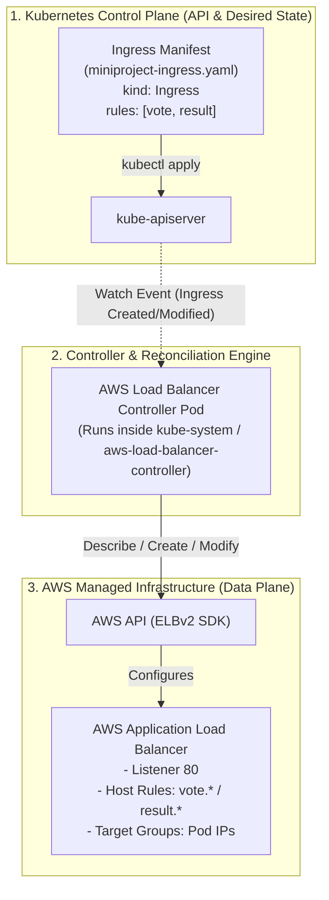

#### The Four Core Primitives
1. **The Ingress Resource:** Declarative Kubernetes API object (`networking.k8s.io/v1`) defining routing rules (hostnames, paths, and target backend Services). *It does not route packets on its own!*
2. **The Ingress Controller:** Active controller daemon (**AWS Load Balancer Controller**) watching the Kubernetes API and translating rules into cloud load-balancing infrastructure (AWS ALB).
3. **The Kubernetes Service:** Persistent abstraction providing a stable virtual IP and CoreDNS name for ephemeral pods via label selectors.
4. **The Workload Pod:** Ephemeral container instance executing application code inside its own network namespace.

> 🎙️ **Speaker Notes:**  
> *"It's crucial to understand the distinction between an Ingress and an Ingress Controller—this is a classic interview question. An Ingress resource is just an API manifest, a set of instructions stored in etcd. On its own, it does absolutely nothing. You need an Ingress Controller running in your cluster. Here, we use the AWS Load Balancer Controller. The controller listens to the Kubernetes API server, detects our voting-ingress manifest, calls the AWS ELBv2 APIs, provisions an internet-facing Application Load Balancer, creates listener rules, and synchronizes target groups with our pod IPs. The Ingress defines the rules; the controller provisions and programs the infrastructure."*

---

## Slide 5 — Architecture Deep Dive
### Dual-Layer Microservice Topology: External Ingress & Internal Mesh

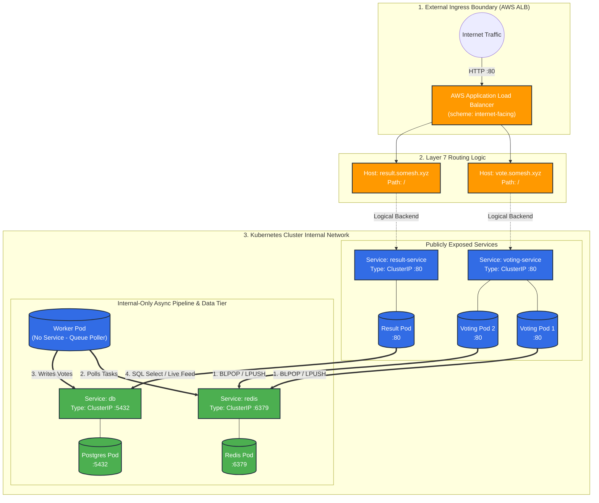

#### Layer-by-Layer Architectural Separation
* **Edge Ingress Layer:** AWS ALB terminates external client TCP handshakes and inspects HTTP Layer-7 headers.
* **Service Abstraction Layer:** Kubernetes `ClusterIP` Services provide stable internal discovery (`voting-service`, `redis`, `db`, `result-service`) via CoreDNS.
* **Application Execution Layer:** Stateless Python and Node.js pods scale horizontally across cluster worker nodes.
* **Internal Data Pipeline:** Redis and PostgreSQL remain completely invisible to the external network, reachable only via cluster-internal CoreDNS.

> 🎙️ **Speaker Notes:**  
> *"Slide 5 illustrates our complete architecture diagram. Notice the clean segregation between external ingress and internal communications. External users access the cluster exclusively via two hostnames hitting the ALB. Once traffic passes the ALB, notice how internal communications operate: the Voting App connects to redis:6379. It doesn't need hardcoded IP addresses because Kubernetes CoreDNS resolves the Service name redis to its ClusterIP. The Worker pod continuously pulls jobs from Redis and writes records to db:5432. Finally, the Result App queries db to read those counts. PostgreSQL and Redis have zero exposure to the internet, satisfying core defense-in-depth principles."*

---

## Slide 6 — Request Flow
### End-to-End Lifecycle: What Happens When a User Opens `vote.somesh.xyz`?

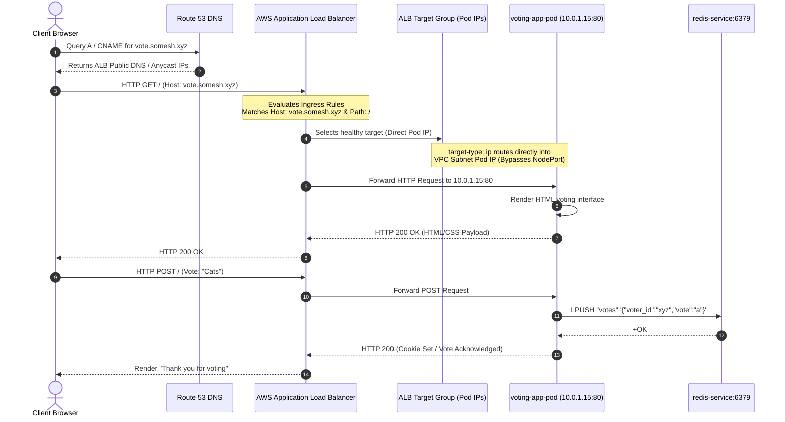

#### The Six-Step Request Traversal
1. **DNS Resolution:** Client browser queries `vote.somesh.xyz`. Route 53 resolves the alias record to AWS ALB public Anycast IPs.
2. **Edge Ingestion:** ALB accepts the HTTP connection on port 80 and extracts the HTTP Layer-7 `Host` header.
3. **Ingress Rule Evaluation:** ALB matches `Host == vote.somesh.xyz` and path prefix `/`.
4. **Target Group Selection:** ALB directs request to Target Group `voting-service` (target mode: `ip`).
5. **Direct Pod Forwarding:** ALB routes directly to the private VPC IP of one of the two `voting-app-pod` replicas (`10.0.1.15:80`) with round-robin distribution.
6. **Application Handling:** The Flask container handles the request, interacts with Redis via internal CoreDNS, and returns HTTP 200 back through the ALB to the client.

> 🎙️ **Speaker Notes:**  
> *"Let's trace a packet step-by-step when a user casts a vote. First, the browser resolves vote.somesh.xyz through DNS, which points to the ALB. Second, the ALB terminates the client connection and inspects the HTTP headers. It sees the Host: vote.somesh.xyz header. Third, the ALB matches this against the listener rules generated by our Ingress manifest. Fourth, because our manifest specifies target-type: ip, the ALB does NOT forward to a cluster node's random NodePort. It forwards the request directly to the private VPC IP of one of our voting app pods! Finally, the voting app processes the POST, enqueues the vote onto Redis, and returns the confirmation response. The client experiences minimal latency because the ALB talks directly to the pod."*

---

## Slide 7 — Host-Based Routing
### Single Load Balancer, Multiple Microservices via HTTP Host Headers

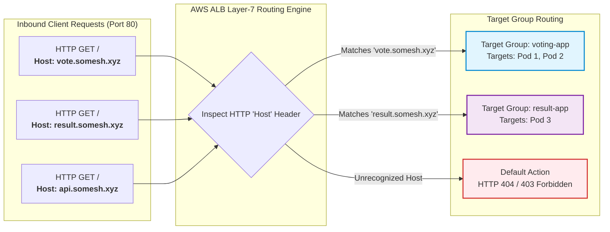

#### Why Host-Based Routing is Essential for Modern DevOps
* **Virtual Hosting at Scale:** Leverages the standard HTTP/1.1 and HTTP/2 `Host` header to differentiate backend destinations without requiring dedicated public IP addresses.
* **Independent Lifecycle Management:** Voting frontend and result analytics teams can deploy and scale services independently while sharing edge infrastructure.
* **Default Security Fallback:** Inbound scans or unmapped domains hitting the ALB IP directly are dropped immediately at the edge (HTTP 404 / 403).

> 🎙️ **Speaker Notes:**  
> *"Host-based routing is the mechanism that unlocks maximum efficiency in cloud networking. Instead of provisioning separate IP addresses or load balancers for every microservice, the ALB inspects the HTTP Host header in the request. If the header is vote.somesh.xyz, the ALB directs the request to the voting target group. If the header is result.somesh.xyz, it routes to the result dashboard target group. If someone scans the load balancer IP directly or passes an unauthorized domain, the ALB drops the connection. This delivers clean domain branding, high resource efficiency, and centralized traffic management."*

---

## Slide 8 — Understanding the AWS ALB Configuration
### Technical Deep Dive into Manifest Annotations

```yaml
# Source: miniproject-ingress.yaml
metadata:
  name: voting-ingress
  annotations:
    alb.ingress.kubernetes.io/scheme: internet-facing
    alb.ingress.kubernetes.io/target-type: ip
    alb.ingress.kubernetes.io/listening-port: '[{"HTTP": 80}]'
spec:
  ingressClassName: alb
```

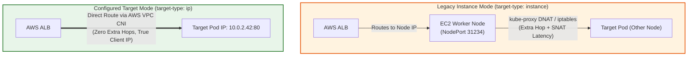

#### Annotation Breakdown & DevOps Implications
1. **`ingressClassName: alb`:** Associates the Ingress with the **AWS Load Balancer Controller** for reconciliation.
2. **`alb.ingress.kubernetes.io/scheme: internet-facing`:** Provisions the AWS ALB in public subnets with public IPs and DNS for public internet access. *(Omitting defaults to `internal`).*
3. **`alb.ingress.kubernetes.io/target-type: ip`:** **Direct Pod Routing.** Targets Pod IP addresses directly via AWS VPC CNI. Eliminates NodePort translation, bypasses `kube-proxy` iptables overhead, and preserves real client IPs.
4. **`alb.ingress.kubernetes.io/listening-port: '[{"HTTP": 80}]'`:** Configures HTTP listener on port 80. *(Note: Canonical controller syntax is `listen-ports`).*

> 🎙️ **Speaker Notes:**  
> *"Slide 8 highlights the exact annotations in our Ingress YAML. First, ingressClassName: alb associates this manifest with the AWS Load Balancer Controller. Second, scheme: internet-facing ensures the ALB gets deployed in public subnets with public DNS names so internet users can vote. Third, and most importantly, target-type: ip. In traditional Kubernetes setups, load balancers route to worker nodes on high-range NodePorts, and kube-proxy routes the packet across nodes using iptables. That introduces extra network hops and hides client IPs. With target-type: ip and AWS VPC CNI, the ALB registers the actual Pod private IPs directly in the ALB Target Group. The load balancer talks directly to the container, cutting latency and eliminating kube-proxy bottlenecks."*

---

## Slide 9 — Ingress vs Service vs Pod
### Architectural Responsibilities & Kubernetes Networking Layers

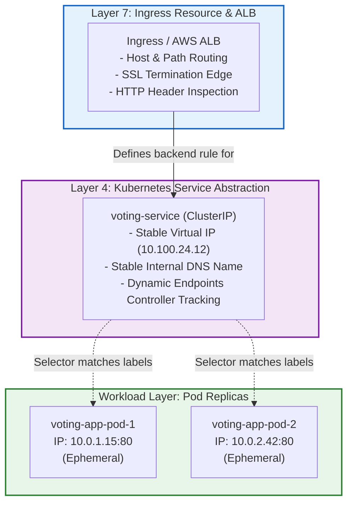

#### Layer Responsibilities & Failure Recovery

| Concept | What It Is | Lifecycle & Ephemerality | Why We Need It |
| :--- | :--- | :--- | :--- |
| **Pod** | Container execution instance | **Ephemeral:** Pods die, crash, get rescheduled, and change IP addresses constantly | Executes business logic (Flask, Node, Postgres) |
| **Service** | Stable Layer-4 virtual network endpoint | **Durable:** IP and DNS name remain static for the entire service lifecycle | Solves pod ephemerality by maintaining live endpoints via selectors |
| **Ingress** | Layer-7 entry point & routing rulebook | **Declarative Policy:** Bridges external HTTP traffic to internal Services | Provides host/path routing, SSL termination, and cloud ELB integration |

#### Why the Voting App Has 2 Replicas
* **Fault Tolerance:** `replicas: 2` in `1-voting-app.yaml` ensures that if one pod crashes, the second handles traffic seamlessly.
* **Continuous Endpoint Reconciliation:** The AWS Load Balancer Controller tracks the Service's `EndpointSlices` to keep the ALB Target Group synchronized with healthy pod IPs.

> 🎙️ **Speaker Notes:**  
> *"A frequent interview trap is confusing Ingresses with Services. An Ingress does not replace a Service—they work together. Pods are ephemeral; when a pod restarts, it gets a brand-new IP address. A Kubernetes Service provides a stable, permanent IP and DNS identity for those pods using label selectors. Even with target-type: ip where the ALB routes to pod IPs, the Ingress still references the Service in its YAML. The AWS Load Balancer Controller watches the Kubernetes Endpoints or EndpointSlices managed by the Service to continuously discover and register healthy pod IPs into the AWS Target Group. And notice that our Voting App deployment runs 2 replicas: if Pod 1 terminates, the Service and Target Group immediately reroute all traffic to Pod 2 without user interruption."*

---

## Slide 10 — Internal Application Flow
### Behind the Ingress: Asynchronous Queue & Data Pipeline

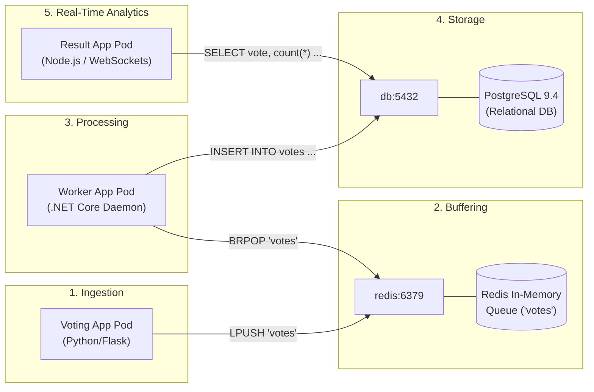

#### Why This Asynchronous Pipeline Design Matters
1. **Frontend Protection:** Python frontend pushes a JSON payload onto the Redis `votes` list in microseconds, immediately returning HTTP 200 without waiting for database disk I/O.
2. **Surge Buffering:** Redis absorbs write spikes, protecting PostgreSQL from connection exhaustion.
3. **Decoupled Persistence:** The .NET Worker daemon pulls votes from Redis and executes idempotent SQL statements into PostgreSQL at a stable rate.
4. **Live Visualization:** The Result App queries PostgreSQL (`db:5432`) and streams updated tallies to viewers.

> 🎙️ **Speaker Notes:**  
> *"Slide 10 details what happens inside the cluster after a vote is received. We deliberately decoupled the voting frontend from the database using Redis and a background worker. Imagine an election or television event where 100,000 votes hit per second. If the voting frontend tried to write directly to PostgreSQL, connection pools would saturate and the database would crash. By using Redis as an in-memory queue, the frontend pushes the vote in microseconds and returns a 200 OK. Our worker pod pops votes from Redis at a controlled rate and writes them to PostgreSQL. Then our Result App simply queries PostgreSQL to display the live score. This architecture isolates write spikes and guarantees resilience."*

---

## Slide 11 — Complete End-to-End Flow
### Master Topology: Edge Ingress & Stateful Backend Integration

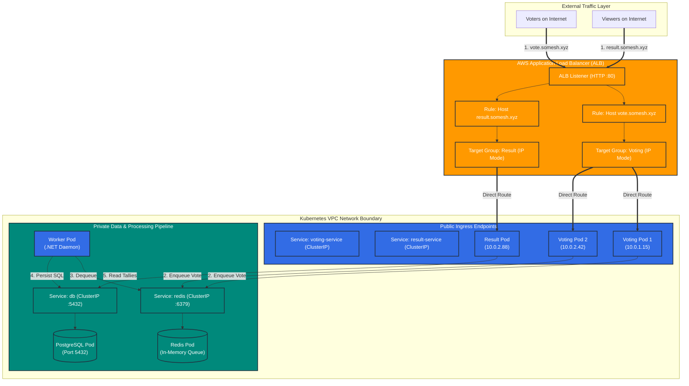

> 🎙️ **Speaker Notes:**  
> *"Slide 11 brings our entire system together into one comprehensive diagram. You can clearly trace both paths: On the left, voter traffic hits vote.somesh.xyz, enters the ALB, routes to our voting pods, and streams into the Redis queue. In the center, our worker continuously processes those votes and updates PostgreSQL. On the right, public users viewing the results connect to result.somesh.xyz. Their traffic hits the very same ALB, but the host rule directs them to the Result App, which reads aggregated tallies from PostgreSQL. This unified design gives us centralized security at the cloud boundary, optimal routing via direct pod IPs, and strict network isolation for internal data pipelines."*

---

## Slide 12 — Current Implementation vs YAML Schema Audit
### Truth-in-Engineering: Manifest Inspection & Identified Limitations

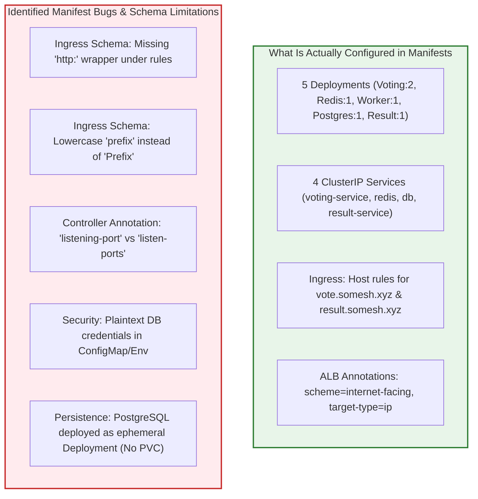

#### Detailed Manifest Audit Findings

| Component / Manifest | Current Configured State | Identified Limitation / Schema Bug | Senior DevOps Assessment |
| :--- | :--- | :--- | :--- |
| **`miniproject-ingress.yaml`** | `networking.k8s.io/v1` Ingress with `ingressClassName: alb` | **Schema Bug:** `paths` defined directly under `host:`, omitting mandatory `http:` block.<br>**Schema Bug:** `pathType: prefix` (lowercase) will fail K8s validation (must be `Prefix`). | `kubectl apply` will fail with validation error. Manifest requires schema correction before deployment. |
| **Ingress Annotations** | `scheme: internet-facing`<br>`target-type: ip`<br>`listening-port: '[{"HTTP": 80}]'` | **Annotation Typo:** AWS Load Balancer Controller canonical key is `listen-ports`, not `listening-port`. | Controller may ignore the port annotation and fallback to defaults or fail to configure listener correctly. |
| **`6-postgres-deploy.yaml`** | `kind: Deployment`, 1 replica, image `postgres:9.4` | **Critical Architecture Risk:** No `PersistentVolumeClaim`. Database storage is ephemeral in container layer. | If the pod restarts, all vote records are irrevocably lost. Version 9.4 reached End-of-Life in 2019. |
| **Database Credentials** | Plaintext `env`: `POSTGRES_USER: postgres`, `POSTGRES_PASSWORD: postgres` | **Security Violation:** Hardcoded plaintext secrets; `POSTGRES_HOST_AUTH_METHOD: trust`. | Credentials exposed in Git and K8s API. Violates compliance standards. |
| **All Workload Deployments** | Basic container specs | **Missing Production Controls:** Zero CPU/Memory `requests` or `limits`; zero `liveness` or `readiness` probes. | Risk of node resource starvation (OOM kills) and routing traffic to unready containers. |

> 🎙️ **Speaker Notes:**  
> *"As a senior DevOps engineer, doing a rigorous manifest audit is mandatory before deploying any code to a cluster. Based strictly on the provided YAML files, I identified several critical issues that must be addressed: First, in miniproject-ingress.yaml, there is a schema violation: the paths key is placed directly under host without the required http wrapper object, and pathType is lowercase prefix instead of title-case Prefix. Kubernetes API validation will reject this manifest immediately upon kubectl apply. Furthermore, the annotation uses listening-port instead of the canonical listen-ports. Second, looking at PostgreSQL: it is configured as a stateless Deployment without a PersistentVolumeClaim. If that pod gets evicted or node dies, all voting data vanishes. In addition, credentials are hardcoded in plaintext and Postgres 9.4 is legacy. Third, none of the deployments define resource requests or health probes. Acknowledging these gaps separates a real DevOps professional from someone blindly copying manifests."*

---

## Slide 13 — Production Improvements
### How I Would Productionize This Architecture

> [!IMPORTANT]
> The features outlined below represent **Recommended Production Improvements** and are not currently configured in the base repository manifests.

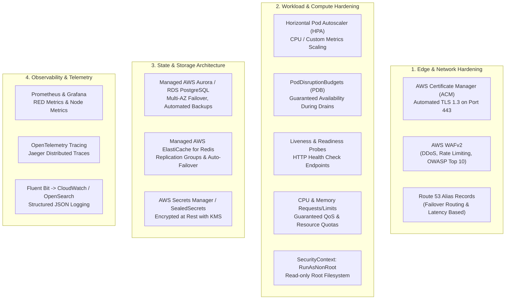

#### Production Remediation Checklist
1. **Edge Security & HTTPS:** Bind an AWS Certificate Manager (ACM) TLS 1.3 wildcard certificate (`*.somesh.xyz`) on port 443; add `alb.ingress.kubernetes.io/ssl-redirect: '443'`; attach AWS WAFv2.
2. **State & Database Externalization:** Replace the ephemeral in-cluster PostgreSQL deployment with an **AWS Aurora PostgreSQL Multi-AZ** cluster. Replace Redis with **AWS ElastiCache for Redis**.
3. **Workload Reliability & Autoscaling:** Add `readinessProbe` and `livenessProbe` on HTTP `/`; implement **Horizontal Pod Autoscaling (HPA)** based on CPU utilization and ALB request rates; configure `PodDisruptionBudget`.
4. **Secret Management & Zero Trust:** Move secrets to **AWS Secrets Manager** synced via the **External Secrets Operator (ESO)**; enforce Kubernetes **NetworkPolicies** so only the Worker can connect to PostgreSQL.

> 🎙️ **Speaker Notes:**  
> *"If tasked with taking this project to production for a high-traffic enterprise, here is my implementation roadmap: First, edge security: we must configure HTTPS using AWS Certificate Manager, terminate TLS 1.3 on the ALB, enforce automatic HTTP-to-HTTPS redirects, and attach AWS WAF to mitigate DDoS attacks and vote tampering. Second, data resilience: we should never run a critical database as a standalone pod with ephemeral storage. I would externalize PostgreSQL to an AWS RDS Multi-AZ instance and Redis to AWS ElastiCache. Third, workload resiliency: we need readiness and liveness probes so the ALB never routes traffic to unready pods, resource requests and limits to prevent node starvation, and Horizontal Pod Autoscalers to scale the voting frontend during traffic spikes. Finally, we would introduce Network Policies to restrict pod-to-pod communication, ensuring only the worker can reach the database."*

---

## Slide 14 — DevOps Engineer Takeaway
### Architectural Synthesis & Engineering Principles

```
  ┌────────────────────────────────────────────────────────────────────────┐
  │                        CORE ARCHITECTURAL PILLARS                      │
  ├────────────────────────────────────────────────────────────────────────┤
  │ 1. INGRESS             Centralizes Layer-7 routing policies & domains  │
  │ 2. AWS ALB             Provides an enterprise-grade cloud entry point  │
  │ 3. SERVICES            Delivers stable, durable internal abstraction   │
  │ 4. PODS                Scales stateless application compute elastically│
  │ 5. ASYNC QUEUE         Decouples write surges from storage bottlenecks │
  │ 6. DATA PERSISTENCE    Maintains authoritative state behind the mesh   │
  └────────────────────────────────────────────────────────────────────────┘
```

#### Final Architectural Philosophy
> *"The foundational design principle of production Kubernetes networking is to keep application services internal, private, and decoupled, while using a controlled, declarative Ingress layer to expose only necessary HTTP entry points to the outside world."*

#### Key Achievements in this Architecture
* **Single Load Balancer Economy:** Zero resource waste by serving multiple hostnames through one ALB.
* **Direct Pod Routing:** Eliminating `kube-proxy` bottlenecks via AWS VPC CNI direct IP target groups.
* **Resilient Decoupling:** Complete isolation between synchronous client requests and asynchronous database commits.
* **Production Preparedness:** Clear understanding of current manifest limits and the roadmap required for enterprise reliability.

> 🎙️ **Speaker Notes:**  
> *"To summarize: this project showcases the power of cloud-native Kubernetes architecture when paired with cloud provider primitives. Ingress gives us intelligent Layer-7 host routing; AWS ALB provides an elastic, managed edge; Kubernetes Services provide stable internal discovery; and our asynchronous Redis-Worker pipeline protects backend data integrity. By understanding not just the YAML syntax, but the underlying traffic mechanics, networking trade-offs, and production gaps, we can design scalable, secure, and cost-effective cloud architectures. Thank you, and I am now excited to take any questions."*

---

# Comprehensive DevOps Interview Q&A Guide (20 Questions & Answers)

### Q1: What is Kubernetes Ingress?
**Answer:** Kubernetes Ingress is an API resource (`networking.k8s.io/v1`) that defines application-layer (Layer 7) routing rules for traffic entering a cluster from the outside. It provides capabilities such as host-based routing (virtual hosting), path-based routing, SSL/TLS termination, and centralized traffic management, directing traffic to internal Kubernetes Services.

### Q2: Why did you use Ingress instead of NodePort or LoadBalancer Services?
**Answer:** 
- **Over NodePort:** NodePorts allocate non-standard high ports (30000–32767), require exposing node IPs directly, create security risks, and lack native Layer-7 routing or SSL termination.
- **Over LoadBalancer Services:** Creating a `LoadBalancer` Service for every frontend microservice provisions a separate, costly AWS load balancer for each app. Ingress consolidates traffic for multiple services (`vote.somesh.xyz` and `result.somesh.xyz`) through a single AWS ALB, simplifying DNS management, reducing cloud costs, and centralizing security policies.

### Q3: What is an Ingress Controller, and how does it differ from an Ingress resource?
**Answer:** An Ingress resource is merely a declarative configuration manifest stored in `etcd`. An Ingress Controller is the actual daemon (such as the AWS Load Balancer Controller or NGINX Ingress Controller) running inside the cluster that watches the Kubernetes API for Ingress objects and translates those rules into real routing infrastructure. In this project, the AWS Load Balancer Controller provisions and updates the AWS ALB.

### Q4: What is the role of the AWS ALB in this architecture?
**Answer:** The AWS Application Load Balancer operates at Layer 7 of the OSI model at the edge of the AWS VPC. It acts as the public entry point, accepts inbound client HTTP connections on port 80, evaluates HTTP Host headers, terminates client TCP connections, and forwards traffic directly to container endpoints inside the cluster VPC.

### Q5: Why are ClusterIP Services used behind the Ingress?
**Answer:** `ClusterIP` is the default Kubernetes Service type that allocates an internal-only virtual IP address accessible only from within the cluster. By placing `ClusterIP` services behind the Ingress, backend microservices remain completely shielded from direct internet access. The Ingress/ALB acts as the sole authorized gatekeeper.

### Q6: What is host-based routing, and how does it work here?
**Answer:** Host-based routing uses the HTTP Layer-7 `Host` request header to route requests arriving at the same IP address and port to different backend services. In our ingress configuration, requests with `Host: vote.somesh.xyz` route to `voting-service`, while requests with `Host: result.somesh.xyz` route to `result-service`.

### Q7: What happens when a user accesses `vote.somesh.xyz`?
**Answer:** 
1. The browser resolves `vote.somesh.xyz` to the ALB's IP addresses via Route 53.
2. The browser initiates an HTTP connection to the ALB on port 80.
3. The ALB parses the `Host` header (`vote.somesh.xyz`).
4. The ALB matches the host rule and selects the target group associated with `voting-service`.
5. The ALB forwards the request directly to one of the two `voting-app` Pod IPs (`target-type: ip`).
6. The pod returns the rendered HTML page back through the ALB to the client.

### Q8: How does traffic reach the Pod with `target-type: ip`?
**Answer:** In AWS EKS using the AWS VPC CNI plugin, every Pod is assigned a real, routable IP address from the VPC subnet. When `alb.ingress.kubernetes.io/target-type: ip` is specified, the AWS Load Balancer Controller registers the Pod IPs directly into the ALB Target Group. The ALB routes traffic directly to the container, completely bypassing worker node NodePorts and `kube-proxy` iptables DNAT routing.

### Q9: What does `alb.ingress.kubernetes.io/scheme: internet-facing` mean?
**Answer:** It tells the AWS Load Balancer Controller to deploy the ALB in public subnets with an internet-routable public IP and a publicly resolvable DNS name. If omitted or set to `internal`, the ALB would be provisioned in private subnets, accessible only within the VPC or over a corporate VPN/DirectConnect.

### Q10: What happens if one of the Voting App Pods fails?
**Answer:** Because `1-voting-app.yaml` defines `replicas: 2`, the deployment controller continuously reconciles the desired state and starts a replacement pod. Concurrently, the ALB target group health checks fail on the dead pod, causing the ALB to immediately stop sending traffic to that IP and forward 100% of requests to the surviving healthy replica with zero downtime.

### Q11: Why are there two replicas for the Voting App but only one for the Result App?
**Answer:** In the current manifests, the Voting App has `replicas: 2` to handle higher concurrent write loads and demonstrate high availability for the primary user flow. The Result App has `replicas: 1` as a baseline single-instance deployment. In production, the Result App should also have at least 2 replicas alongside Horizontal Pod Autoscaling (HPA).

### Q12: Why is Redis used between the Voting App and PostgreSQL?
**Answer:** Redis acts as an in-memory queue and buffer. Ingesting votes into a relational database synchronously under high traffic leads to connection exhaustion, lock contention, and high latency. Pushing votes into Redis takes fractions of a millisecond, decoupling fast frontend ingestion from database persistence.

### Q13: What is the role of the Worker deployment?
**Answer:** The Worker is an asynchronous consumer daemon written in .NET. It continuously polls or blocks on the Redis `votes` queue, extracts raw voting events, processes the payload, and writes the vote record into PostgreSQL. Notice that the Worker does not have a Kubernetes Service because no other component sends inbound network traffic to it.

### Q14: Why does PostgreSQL have a ClusterIP Service named `db`?
**Answer:** Both the Worker and the Result App need to connect to PostgreSQL over TCP port 5432. Pod IPs are ephemeral and change whenever a pod restarts. The ClusterIP Service `db` gives PostgreSQL a stable internal DNS name (`db.default.svc.cluster.local`) and virtual IP that never changes.

### Q15: Did you spot any schema bugs or syntax errors in the provided Ingress manifest?
**Answer:** Yes, three key issues:
1. **Schema Violation:** Under `spec.rules[].host`, the manifest places `paths:` directly without the required `http:` parent key required by `networking.k8s.io/v1`.
2. **Invalid Capitalization:** `pathType: prefix` is lowercase; the Kubernetes v1 schema requires `Prefix`, `Exact`, or `ImplementationSpecific`.
3. **Annotation Typo:** The annotation is written as `alb.ingress.kubernetes.io/listening-port`, whereas the official AWS Load Balancer Controller annotation is `alb.ingress.kubernetes.io/listen-ports`.

### Q16: How would you enable HTTPS/TLS in this architecture?
**Answer:**
1. Request a public wildcard SSL certificate (`*.somesh.xyz`) in AWS Certificate Manager (ACM).
2. Add annotations to the Ingress:
   ```yaml
   alb.ingress.kubernetes.io/listen-ports: '[{"HTTP": 80}, {"HTTPS": 443}]'
   alb.ingress.kubernetes.io/certificate-arn: arn:aws:acm:region:account:certificate/xxx
   alb.ingress.kubernetes.io/ssl-redirect: '443'
   ```
3. The ALB will terminate TLS at the edge and automatically redirect HTTP port 80 traffic to HTTPS port 443.

### Q17: How would you make PostgreSQL production-ready?
**Answer:** In production, I would not run PostgreSQL as a single-replica Deployment with ephemeral storage. I would externalize it to **AWS Aurora PostgreSQL** or **Amazon RDS Multi-AZ**. If required to run in-cluster, I would deploy it as a `StatefulSet` attached to persistent EBS volumes via `PersistentVolumeClaims` (using the AWS EBS CSI driver) with automated snapshotting and replication.

### Q18: How would you secure the database credentials currently in plaintext?
**Answer:** Currently, `POSTGRES_USER` and `POSTGRES_PASSWORD` are hardcoded in plaintext in `6-postgres-deploy.yaml`. In production, I would store credentials in **AWS Secrets Manager**, encrypt them with AWS KMS, and synchronize them into Kubernetes Secrets using the **External Secrets Operator (ESO)** or CSI Secrets Store Driver, referencing them in the pod via `secretKeyRef`.

### Q19: What would you add for pod health checking and observability?
**Answer:** 
- **Health Probes:** Add `readinessProbe` and `livenessProbe` to all deployments so Kubernetes and the ALB do not route traffic to uninitialized or deadlocked pods.
- **Resource Limits:** Define `resources.requests` and `resources.limits` for CPU and Memory to prevent noisy neighbors and out-of-memory node crashes.
- **Observability:** Deploy Prometheus and Grafana for metrics, Fluent Bit for shipping container logs to Amazon CloudWatch / OpenSearch, and OpenTelemetry for distributed request tracing.

### Q20: How would you implement network isolation inside the cluster?
**Answer:** By default, Kubernetes has a flat network where all pods can communicate with all other pods. In production, I would apply **Kubernetes NetworkPolicies** enforcing zero-trust:
- Allow ingress traffic only to `voting-app` and `result-app` pods.
- Allow access to `redis` only from `voting-app` and `worker`.
- Allow access to `db` only from `worker` and `result-app`.
- Block all direct internet egress from the database pod.

---

### Corrected Production Ingress Manifest
```yaml
apiVersion: networking.k8s.io/v1
kind: Ingress
metadata:
  name: voting-ingress
  namespace: default
  labels:
    app.kubernetes.io/name: voting-app-ingress
    app: voting-app
  annotations:
    # AWS Load Balancer Controller Settings
    alb.ingress.kubernetes.io/scheme: internet-facing
    alb.ingress.kubernetes.io/target-type: ip
    alb.ingress.kubernetes.io/listen-ports: '[{"HTTP": 80}, {"HTTPS": 443}]'
    # SSL & Security Hardening (Production Ready)
    alb.ingress.kubernetes.io/ssl-redirect: '443'
    # alb.ingress.kubernetes.io/certificate-arn: arn:aws:acm:us-east-1:123456789012:certificate/example-uuid
    # Health Check Customization
    alb.ingress.kubernetes.io/healthcheck-path: /
    alb.ingress.kubernetes.io/healthcheck-interval-seconds: '15'
    alb.ingress.kubernetes.io/healthcheck-timeout-seconds: '5'
    alb.ingress.kubernetes.io/healthy-threshold-count: '2'
    alb.ingress.kubernetes.io/unhealthy-threshold-count: '2'
spec:
  ingressClassName: alb
  rules:
    - host: vote.somesh.xyz
      http:
        paths:
          - path: /
            pathType: Prefix
            backend:
              service:
                name: voting-service
                port:
                  number: 80
    - host: result.somesh.xyz
      http:
        paths:
          - path: /
            pathType: Prefix
            backend:
              service:
                name: result-service
                port:
                  number: 80
```
