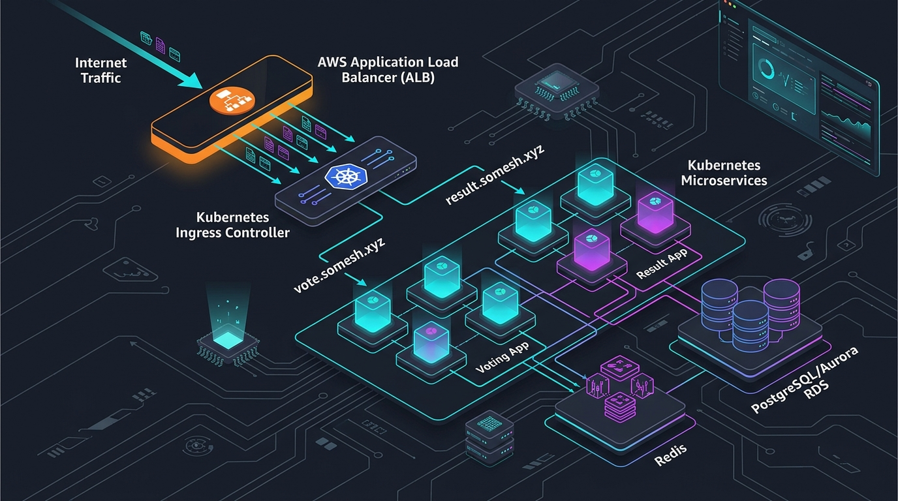
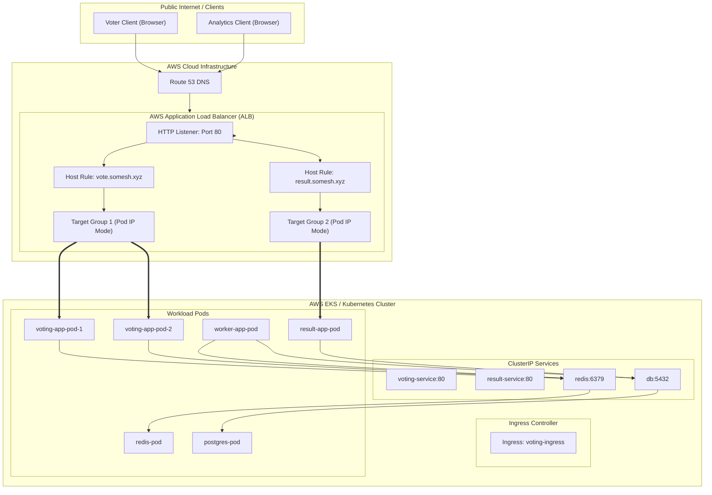

# Kubernetes Ingress Architecture: AWS ALB & Example Voting App



A production-style Kubernetes implementation demonstrating **Layer-7 Ingress Routing with AWS Application Load Balancer (ALB)**, microservice networking, direct Pod IP routing, and asynchronous data pipelines on an Example Voting Application.

---

## 📑 Repository Contents

| File | Description |
| :--- | :--- |
| **[`miniproject-ingress.yaml`](./miniproject-ingress.yaml)** | Kubernetes Ingress definition with AWS ALB annotations (`internet-facing`, `target-type: ip`) |
| **[`1-voting-app.yaml`](./1-voting-app.yaml)** | Voting App Deployment (Python/Flask, 2 replicas, port 80) |
| **[`2-volting-app-service.yaml`](./2-volting-app-service.yaml)** | Voting App ClusterIP Service |
| **[`3-redics-app.yaml`](./3-redics-app.yaml)** | Redis In-Memory Queue Deployment (1 replica, port 6379) |
| **[`4-redics-service.yaml`](./4-redics-service.yaml)** | Redis ClusterIP Service |
| **[`5-worker-deploy.yaml`](./5-worker-deploy.yaml)** | Background Worker Deployment (.NET Core Daemon) |
| **[`6-postgres-deploy.yaml`](./6-postgres-deploy.yaml)** | PostgreSQL Database Deployment (Port 5432) |
| **[`7-postgres-service.yaml`](./7-postgres-service.yaml)** | PostgreSQL ClusterIP Service (`db`) |
| **[`8-result-app-deployment.yaml`](./8-result-app-deployment.yaml)** | Result App Deployment (Node.js/Angular, port 80) |
| **[`9-result-service.yaml`](./9-result-service.yaml)** | Result App ClusterIP Service |
| **[`KUBERNETES_INGRESS_PRESENTATION.md`](./KUBERNETES_INGRESS_PRESENTATION.md)** | Full 14-slide technical presentation, speaker notes, diagrams, and 20 interview Q&As |
| **[`presentation.html`](./presentation.html)** | Interactive slide deck with dark mode, Mermaid diagrams, and speaker notes drawer |
| **[`k8s_ingress_alb_hero.jpg`](./k8s_ingress_alb_hero.jpg)** | Cloud architecture visual |

---

## 🏛️ Architecture Overview



---

## 🚀 Key Technical Highlights

1. **Host-Based Layer-7 Routing:**
   * `vote.somesh.xyz` routes to `voting-service:80` (Voting App, 2 replicas).
   * `result.somesh.xyz` routes to `result-service:80` (Result App, 1 replica).
   * Unifies external traffic through a single AWS ALB rather than spinning up multiple expensive `LoadBalancer` services.

2. **Direct Pod Routing via AWS VPC CNI (`target-type: ip`):**
   * Eliminates the traditional `NodePort` intermediate hop and `kube-proxy` iptables DNAT overhead.
   * Traffic routes from ALB directly into the Pod's private VPC IP address.

3. **Asynchronous Microservices Pipeline:**
   * **Voting App (Python):** Enqueues votes to Redis in sub-milliseconds without blocking on database disk I/O.
   * **Redis:** Decouples ingestion from storage, absorbing traffic spikes.
   * **Worker (.NET Core):** Drains Redis and persists records to PostgreSQL at a steady rate.
   * **PostgreSQL:** Relational database accessible only internally via Service `db:5432`.
   * **Result App (Node.js):** Queries PostgreSQL and streams live scores to viewers.

---

## 🖥️ Interactive Presentation

Open the bundled interactive presentation in your browser:
```bash
open presentation.html
```
* **Navigate:** Use Left (`←`) and Right (`→`) arrow keys.
* **Speaker Notes:** Press `S` to toggle presenter notes.
* **Interview Q&A:** Click the **📋 20 Interview Q&As** button in the header.

---

## 📖 Deep Dive & Interview Guide
For full slide notes, architecture comparisons, manifest audit findings, and 20 detailed DevOps interview questions and answers, see:
👉 **[`KUBERNETES_INGRESS_PRESENTATION.md`](./KUBERNETES_INGRESS_PRESENTATION.md)**
